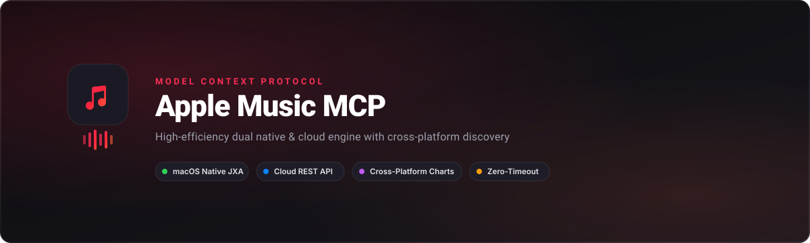

<div align="center">
  

  # Apple Music MCP

  **A high-performance Model Context Protocol (MCP) server for Apple Music.**<br />
  Dual native macOS JXA &amp; cloud REST engine with cross-platform discovery, async batching, and zero-timeout execution.

  <p>
    <a href="https://www.npmjs.com/package/@saitarrunpitta/apple-music-mcp"></a>
    <a href="https://github.com/saitarrun/apple-music-mcp/blob/main/LICENSE"></a>
    <a href="https://python.org"></a>
    <a href="https://modelcontextprotocol.io"></a>
    <a href="https://apple.com/macos"></a>
  </p>

  <p>
    <a href="#-quick-start">Quick Start</a> •
    <a href="#-mcp-client-setup">Client Setup</a> •
    <a href="#-tools-reference">Tools</a> •
    <a href="#-cli">CLI</a> •
    <a href="#-tags--discoverability">Keywords</a>
  </p>
</div>

---

## ⚡ Quick Start

Run instantly with **`npx`** or **`uvx`** (zero install required):

### Option A: Using `npx` (Recommended)
```bash
npx -y @saitarrunpitta/apple-music-mcp
```

### Option B: Using `uvx`
```bash
uvx --from git+https://github.com/saitarrun/apple-music-mcp.git apple-music-mcp serve
```

### Option C: Install locally via npm or pip
```bash
npm install -g @saitarrunpitta/apple-music-mcp
# or
pip install git+https://github.com/saitarrun/apple-music-mcp.git
```

---

## 🔌 MCP Client Setup

Add `apple-music` to your preferred AI assistant in seconds:

### 1. Antigravity / AGY CLI

```bash
agy mcp add apple-music -- npx -y @saitarrunpitta/apple-music-mcp
```

### 2. Claude Desktop (`claude_desktop_config.json`)

```json
{
  "mcpServers": {
    "apple-music": {
      "command": "npx",
      "args": [
        "-y",
        "@saitarrunpitta/apple-music-mcp"
      ]
    }
  }
}
```

### 3. Cursor (`~/.cursor/mcp.json`)

```json
{
  "mcpServers": {
    "apple-music": {
      "command": "npx",
      "args": [
        "-y",
        "@saitarrunpitta/apple-music-mcp"
      ]
    }
  }
}
```

### 4. Codex MCP

```bash
codex mcp add apple-music -- npx -y @saitarrunpitta/apple-music-mcp
```

---

## ✨ Features at a Glance

- **⚡ Zero-Timeout JXA Engine**: Reads playlists with 1,000+ songs in under **100ms** without AppleScript freezes.
- **🌐 Cross-Platform Charts**: Direct discovery feeds from **Shazam**, **Spotify**, **YouTube**, and **Apple Music**.
- **🚀 Async Parallel Batching**: Add or remove 100+ songs in parallel in **under 1 second**.
- **🎵 Pure-Audio Enforcement**: Auto-filters out music videos and lyric videos to keep playlists pure audio.
- **🛡️ 100% Duplicate Prevention**: Built-in fuzzy matching prevents duplicate song additions.
- **🔐 Automatic Safari Auth**: Extracts web player tokens seamlessly from Safari without manual API keys.
- **🧠 Smart Recommendations**: Real-time track suggestions based on your listening history & artist similarity.

---

## 🛠️ Tools Reference

| Category | Tool | Description |
| :--- | :--- | :--- |
| **Discovery** | `apple_music_get_cross_platform_charts` | Pull top hits from Shazam, Spotify, YouTube, or Apple Music charts. |
| | `apple_music_populate_from_charts` | Populate a playlist directly from any chart with deduplication. |
| | `apple_music_get_music_recommendations` | Smart recommendations based on listening history & artists. |
| | `apple_music_get_recently_played` | Fetch recent listening history from Apple Music cloud. |
| | `apple_music_get_heavy_rotation` | Fetch most played albums and playlists. |
| **Playlists** | `apple_music_list_playlists` | List all library playlists with track counts and descriptions. |
| | `apple_music_get_playlist_tracks` | Fast bulk retrieval of tracks (title, artist, album, duration). |
| | `apple_music_add_tracks_to_playlist` | Parallel batch add with zero duplicates. |
| | `apple_music_remove_tracks_from_playlist` | Bulk remove track relationship IDs. |
| | `apple_music_create_playlist` | Create new playlist with custom description. |
| | `apple_music_delete_playlist` | Safely delete playlist without removing songs from library. |
| | `apple_music_set_playlist_description` | Update playlist description and sync to iCloud. |
| **Catalog** | `apple_music_search_catalog` | Search global Apple Music catalog (songs, albums, artists, playlists). |
| | `apple_music_resolve_song` | Pin exact studio audio catalog ID for title/artist. |
| | `apple_music_get_artist_top_songs` | Get top-rated songs for any artist. |
| | `apple_music_get_catalog_playlist_tracks` | Fetch tracks from official Apple curated playlists (`pl.xxx`). |
| **Playback** | `apple_music_playback_control` | Control player (`play`, `pause`, `skip`, `volume`, `shuffle`, `rate`, `love`). |
| | `apple_music_airplay_devices` | Discover available AirPlay speakers and HomePods. |
| **Curation** | `apple_music_curation_clean_videos` | Strip video entities and swap with official studio audio songs. |
| | `apple_music_curation_deduplicate` | Deduplicate playlist editions, keeping canonical tracks. |
| | `apple_music_curation_merge_playlists` | Merge playlists with 100% deduplication. |

---

## 💻 CLI Commands

```bash
# Check status & active tokens
apple-music-mcp status

# Extract authentication tokens from open Safari session
apple-music-mcp login

# Clear catalog cache
apple-music-mcp clean-cache

# Run MCP server over stdio
apple-music-mcp serve
```

---

## 🏷️ Tags & Discoverability

`#ModelContextProtocol` `#MCP` `#MCPServer` `#AppleMusic` `#ClaudeAI` `#CursorAI` `#AnthropicClaude` `#AIAgents` `#MusicKit` `#Spotify` `#Shazam` `#YouTubeMusic` `#AppleScript` `#Python` `#OpenSource` `#DeveloperTools` `#LLM` `#Automation` `#PlaylistGenerator`

---

## 📄 License

MIT © [saitarrun](https://github.com/saitarrun)
